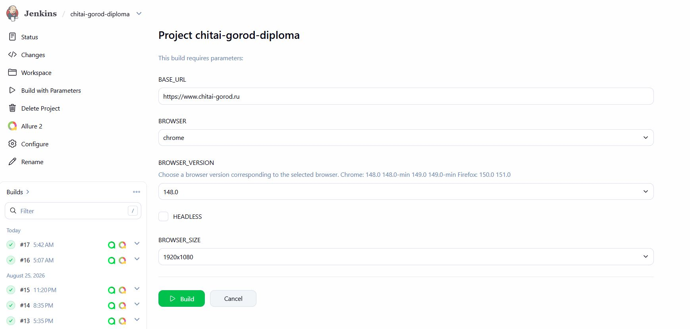
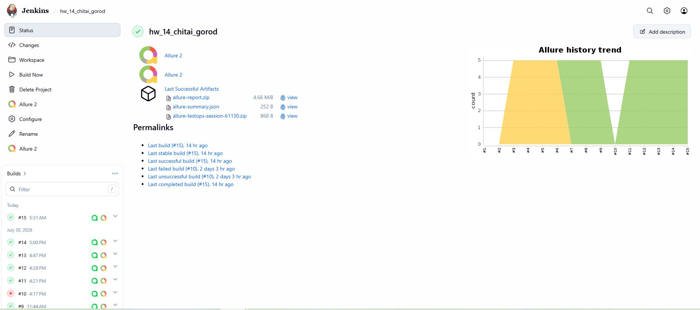
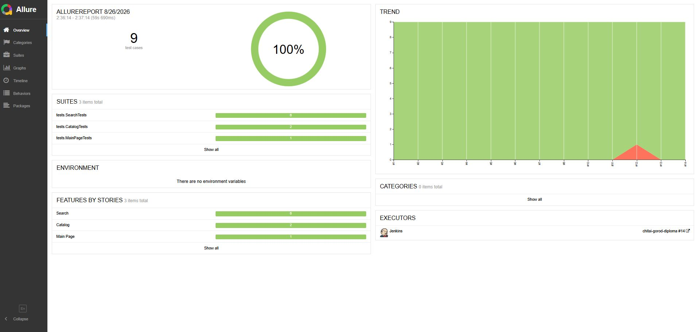
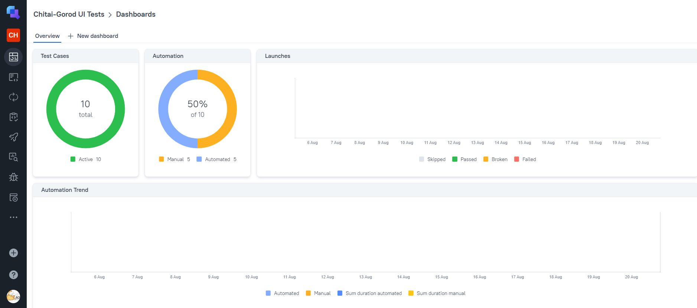
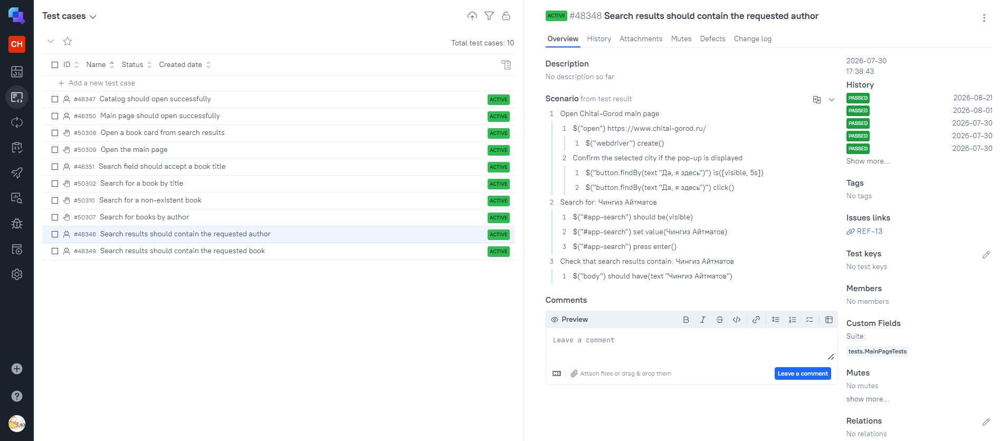
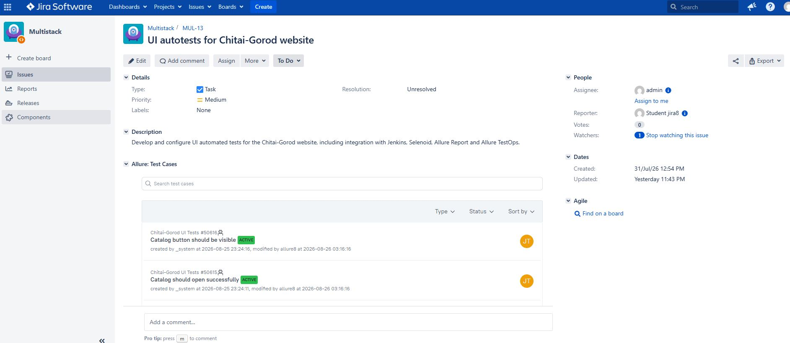

# UI Autotests for Chitai-Gorod

<p align="center">
  <a href="https://www.chitai-gorod.ru/">
    
  </a>
</p>

This project is designed to automate UI testing of the [Chitai-Gorod](https://www.chitai-gorod.ru/) online bookstore.

## Test Coverage

The project includes **8 automated UI test methods with 9 test executions**:

- opening the home page;
- checking that the catalog button is visible;
- opening the catalog;
- entering a book title in the search field;
- searching for the author “Чингиз Айтматов”;
- searching for the book “Белый пароход”;
- searching for the books “Джамиля” and “Плаха” using a parameterized test;
- searching for a non-existent book and checking that no results are found.

### Manual Test Cases

The project also includes manual test cases in Allure TestOps covering:

- searching for a book by title;
- searching for books by author;
- opening a book card from search results;
- opening the main page;
- searching for a non-existent book.

## Technologies

<p align="center">
  
  
  
  
  
  
  
  
</p>

<p align="center">
  
  
  
  
</p>

## Running the Tests

The following command is used to run the tests locally on Windows:

```powershell
.\gradlew clean test
```

## Remote Test Execution in Jenkins

The project is configured for **parameterized remote test execution in Jenkins using Selenoid**.

### [Open Jenkins Job](https://jenkins.qa.guru/job/chitai-gorod-diploma/)

The following parameters can be selected before the build:




The tests are executed in Jenkins using Gradle with parameters passed as system properties.

An example of a successful Jenkins build:



## Integrations

### [Allure Report](https://jenkins.qa.guru/job/chitai-gorod-diploma/lastSuccessfulBuild/allure/)

Allure Report is used to visualize test execution results.

The report contains:

- test execution status;
- test steps;
- screenshots;
- page source;
- browser console logs;
- videos of test execution in Selenoid;
- execution history.



### [Allure TestOps](https://allure.qa.guru/project/5302/dashboards)

Test execution results are sent automatically from Jenkins to **Allure TestOps**.

Allure TestOps is used for:

- automated test case management;
- manual test case management;
- launch history;
- execution results;
- test steps;
- test automation statistics;
- Jira integration.



An example of an Allure TestOps launch with executed automated tests, test steps and Jira integration:



### [Jira](https://jira.qa.guru/browse/MUL-13)

The following Jira issue was created for the project:

**MUL-13 — UI autotests for Chitai-Gorod website**

The Jira issue describes the UI automation project and its integrations with Jenkins, Selenoid, Allure Report and Allure TestOps.



## Telegram Notifications

Telegram notifications are configured to send test execution results and a link to the Allure Report after the Jenkins build.

Due to network restrictions in the Jenkins environment, connection to the Telegram API may be unavailable.

## Repository

### [GitHub Repository](https://github.com/tumenbaevaj/chitai-gorod-diploma)