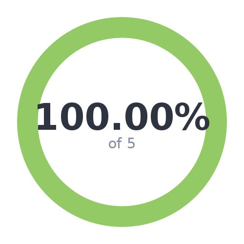

# UI Autotests for Chitai-Gorod

Проект UI-автотестов для сайта интернет-магазина [«Читай-город»](https://www.chitai-gorod.ru/).

## Проверяемая функциональность

В проекте реализовано 5 UI-автотестов:

- успешное открытие главной страницы;
- открытие каталога;
- ввод названия книги в поле поиска;
- поиск автора «Чингиз Айтматов»;
- поиск книги «Белый пароход».

## Используемые технологии

<p align="center">
  
  
  
  
  
  
  
  
</p>

<p align="center">
  
  
  
  
</p>

## Запуск тестов

Для локального запуска тестов в Windows используется команда:

```powershell
.\gradlew clean test
```

## Удалённый запуск в Jenkins

Тесты запускаются в Jenkins с использованием Selenoid.

### [Открыть Jenkins Job](https://jenkins.qa.guru/view/java-students/job/hw_14_chitai_gorod/)

Команда запуска в Jenkins:

```text
clean test
```


## Интеграции

### [Allure Report](https://jenkins.qa.guru/job/hw_14_chitai_gorod/lastSuccessfulBuild/allure/)

В Allure Report отображаются результаты выполнения тестов, шаги, скриншоты, Page Source, логи браузера и видеозаписи прохождения тестов в Selenoid.


### [Allure TestOps](https://allure.autotests.cloud/project/5302/dashboards)

Результаты выполнения тестов из Jenkins передаются в Allure TestOps.

В Allure TestOps отображаются автоматизированные тест-кейсы, история запусков и статистика выполнения тестов.


Пример запуска с выполненными тестами, шагами и связью с Jira:


### [Jira](https://jira.qa.guru/browse/REF-13)

Для проекта создана задача:

**REF-13 — UI autotests for Chitai-Gorod website**

Задача Jira связана с автоматизированными тест-кейсами и запуском в Allure TestOps.


## Telegram-уведомления

После завершения сборки Jenkins отправляет в Telegram уведомление с результатами выполнения тестов и ссылкой на Allure Report.



## Репозиторий

### [GitHub Repository](https://github.com/tumenbaevaj/full_project)